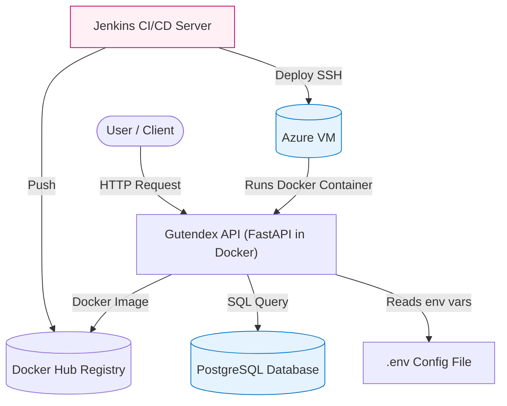

# Gutendex API

## Overview

**Gutendex** is a modern, scalable API for querying the Project Gutenberg open books dataset, exposing books, authors, languages, and topics with powerful full-text and filter-based search—**plus natural-language querying via a local LLM**. Built with FastAPI, PostgreSQL, and Docker, it’s designed for high performance and full automation via Jenkins CI/CD on Azure.

**Note:** No Docker Compose is used in production for explicit control and robust separation of concerns.

---

## Features

* **REST API** for querying books, authors, topics, and download counts.
* **/chat endpoint** for LLM-powered natural language search and summarization.
* **FastAPI** async backend for low-latency requests.
* **PostgreSQL** for persistent storage.
* **Dockerized** for reliable, repeatable deployments.
* **Automated CI/CD** with Jenkins and Docker Hub.
* **Highly configurable** via `.env` file.
* **Comprehensive OpenAPI docs** at `/docs` and `/redoc`.

---

## Technology Stack

* Python 3.9
* FastAPI
* SQLAlchemy (ORM)
* PostgreSQL (DB)
* Docker
* Jenkins (CI/CD)
* Azure VM (Production deployment)
* Docker Hub (Image registry)
* pytest (Testing)
* HuggingFace Transformers (LLM)

---

## Architecture & Deployment Flow

### System Architecture



### System Flow

1. **User** sends HTTP request (`/books`, `/chat`, etc.).
2. **FastAPI app** (inside Docker) reads `.env`, queries PostgreSQL, or runs LLM.
3. **Jenkins** pulls latest code, builds/tests image, pushes to Docker Hub, SSHes to Azure VM, pulls latest image, and restarts the container.
4. **No Docker Compose**: DB and API run independently; explicit `docker run` commands control the stack.

---

## Why Not Docker Compose?

* **Production control:** Compose is for local/dev or simple multi-service prototyping. In prod, explicit commands are more secure and transparent.
* **Separation of concerns:** DB is managed independently (via systemd, managed PaaS, or cloud tools).
* **CI/CD integration:** Jenkins orchestrates deployments step-by-step.

---

## Configuration

All sensitive info is set in a `.env` file (never committed to git):

```ini
DATABASE_URL=postgresql://<user>:<password>@<server>:5432/<db>
LLM_MODEL_PATH=/path/to/model          # For LLM features
```

**.env file is copied from Azure VM to Jenkins workspace before build.**

---

## Running Locally

1. **Prerequisites:**

   * Python 3.9
   * Docker
   * PostgreSQL (local or remote)

2. **Setup:**

   ```bash
   git clone https://github.com/ankit961/gutendex.git
   cd gutendex
   cp .env.example .env   # Use real values
   ```

3. **Build Docker image:**

   ```bash
   docker build -t gutendex-app .
   ```

4. **Run the container:**

   ```bash
   docker run --rm --env-file .env -p 8000:8000 gutendex-app
   ```

   Open [http://localhost:8000/docs](http://localhost:8000/docs)

---

## CI/CD Pipeline (Jenkins)

**Stages:**

1. Checkout latest code from GitHub.
2. Copy `.env` from Azure VM.
3. Build Docker image (`docker build`).
4. Run tests inside container (`pytest`).
5. Push to Docker Hub.
6. SSH to Azure VM, pull image, stop old container, run new one.

**Example Jenkinsfile snippet:**

```groovy
stage('Copy .env from Azure VM') {
    steps {
        sshagent(['azureuser-ssh-key']) {
            sh "scp azureuser@<AZURE_VM_IP>:/home/azureuser/gutendex/.env .env"
        }
    }
}
...
stage('Build Docker Image') {
    steps {
        script { docker.build("gutendex-app") }
    }
}
...
stage('Deploy to Azure VM') {
    steps {
        sshagent(['azureuser-ssh-key']) {
            sh '''
                ssh azureuser@<AZURE_VM_IP> '
                    docker pull ankitchauhan961/gutendex-app:latest &&
                    docker stop gutendex-app || true &&
                    docker rm gutendex-app || true &&
                    cd /home/azureuser/gutendex &&
                    docker run -d --env-file .env --name gutendex-app -p 8000:8000 ankitchauhan961/gutendex-app:latest
                '
            '''
        }
    }
}
```

---

## LLM (Large Language Model) Features

### What It Does

* Converts natural language queries (e.g., "top 5 French classics") to smart database filters.
* Returns a summary of found books in readable English.
* Powers the `/chat` endpoint, using your **local HuggingFace model** (see `LLM_MODEL_PATH`).

**Implementation:**

* On `/chat` POST, the backend uses the LLM to parse and generate JSON filters.
* Model is loaded from a locally provided path, using HuggingFace `pipeline`.
* Summaries are also LLM-generated for user-friendly responses.

**Example LLM filter extraction code:**

```python
{
  "filters": {
    "sort": "download_count:desc",
    "limit": 6,
    "language": ["fr"]
  },
  ...
}
```

---

## API Endpoints

### 1. `GET /books` – **List Books**

Retrieve a paginated list of books, filterable by any combination:

| Query Param | Type                  | Description                           |
| ----------- | --------------------- | ------------------------------------- |
| ids         | array\<integer>       | Gutenberg book IDs                    |
| language    | array\<string>        | Language codes (e.g., `en`, `fr`)     |
| mime\_type  | string                | Format/mime-type (e.g., `text/plain`) |
| topic       | array\<string>        | Search in subjects or bookshelves     |
| author      | array\<string>        | Author name (partial match)           |
| title       | array\<string>        | Book title (partial match)            |
| skip        | integer (default: 0)  | Records to skip                       |
| limit       | integer (default: 25) | Max records to return (`1-100`)       |

**Example:**

```http
GET /books?language=fr&limit=2
```

**Sample Response:**

```json
{
  "count": 6,
  "results": [
    {
      "id": 17489,
      "title": "Les misérables Tome I: Fantine",
      "download_count": 718,
      "authors": [{ "id": 82, "name": "Hugo, Victor", "birth_year": 1802, "death_year": 1885 }],
      "subjects": [{ "id": 61, "name": "Historical fiction" }],
      "bookshelves": [{ "id": 67, "name": "FR Littérature" }],
      "languages": [{ "id": 5, "code": "fr" }],
      "formats": [{ "mime_type": "application/epub+zip", "url": "http://www.gutenberg.org/ebooks/17489.epub.images" }]
    }
  ]
}
```

### 2. `POST /chat` – **LLM-powered Search and Summary**

Handles user queries, runs the LLM to create DB filters, fetches books, and summarizes results.

**Request Body:**

```json
{
  "query": "top 6 fr language book"
}
```

**Response:**

```json
{
  "filters": {
    "sort": "download_count:desc",
    "limit": 6,
    "language": ["fr"]
  },
  "count": 6,
  "results": [
    {
      "id": 17489,
      "title": "Les misérables Tome I: Fantine",
      "download_count": 718,
      ...
    }
  ],
  "summary": "Categories: Literature and Classics | France | English language. Description: This is a comprehensive guide to reading French books online..."
}
```

### 3. `GET /health` – **Health Check**

Returns `"ok"` if the API is running.

---

## Data Schemas

### BookOut

```json
{
  "id": 0,
  "title": "string",
  "download_count": 0,
  "authors": [{ "id": 0, "name": "string", "birth_year": 0, "death_year": 0 }],
  "subjects": [{ "id": 0, "name": "string" }],
  "bookshelves": [{ "id": 0, "name": "string" }],
  "languages": [{ "id": 0, "code": "string" }],
  "formats": [{ "mime_type": "string", "url": "string" }]
}
```

### ChatBooksResponse

```json
{
  "filters": { "sort": "download_count:desc", "limit": 6 },
  "count": 6,
  "results": [ <BookOut>, ... ],
  "summary": "string"
}
```

---

## Troubleshooting

**Database Connection**

* **Connection refused?**

  * Check Postgres status: `sudo systemctl status postgresql`
  * Can you connect with `psql`?
  * `listen_addresses` in `postgresql.conf` should be `'*'`
  * Add Docker bridge IPs to `pg_hba.conf`, e.g.: `host all all x.x.x.x/16 md5`
  * Reload: `sudo systemctl reload postgresql`

* **No pg\_hba.conf entry?**

  * Add Docker subnet in `pg_hba.conf`.

* **Host resolution errors?**

  * Use the **actual VM IP** (e.g., `10.x.x.x`) or `localhost` (if API & DB run on same VM).

**Other issues**

* **Port in use:**
  Free it: `sudo lsof -i :8000; sudo kill <pid>`
* **Docker daemon permission:**
  `sudo usermod -aG docker <user>` and re-login.
* **Debug logs:**
  `docker logs <container-id>`
* **Shell into container:**
  `docker exec -it <container-id> /bin/bash`

---

## Security Best Practices

* Never commit your `.env` file.
* Use strong DB/user passwords.
* Restrict DB access to VM only.
* Rotate SSH keys and credentials regularly.

---

## FAQ

**Q: Can I use Docker Compose?**
A: You can for local dev, but in production, DB and API are managed separately for reliability and security.

**Q: How do I add environment variables?**
A: Add to `.env`, update code if needed, and redeploy.

**Q: Where are the docs?**
A: [http://135.235.193.30/docs](http://135.235.193.30/docs) or `/redoc`.

---

## Try Out the API

* **Swagger UI:** [http://135.235.193.30/docs](http://135.235.193.30/docs)
* **ReDoc:** [http://135.235.193.30/redoc](http://135.235.193.30/redoc)

